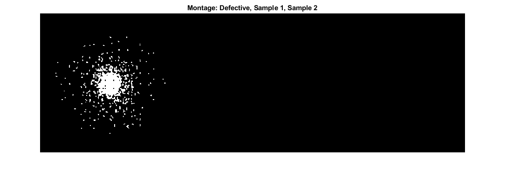

# Image Processing - Intruder Detection - MATLAB

> Small repository for Image Processing
> Coded on first week at Fontys University

Contents
--------

*   [Import images](#1)
*   [Subtract images](#2)
*   [Apply Threshhold](#3)
*   [Fill regions](#4)
*   [Determine defective wafer](#5)

Import images
-------------

    referenceWafer = imread("week2\\wafer0.png");
    referenceWafer = rgb2gray(referenceWafer);
    defectiveWafer = imread("week2\\wafer1.png");
    defectiveWafer = rgb2gray(defectiveWafer);
    wafer1 = imread("week2\\wafer2a.png");
    wafer1 = rgb2gray(wafer1);
    wafer2 = imread("week2\\wafer2b.png");
    wafer2 = rgb2gray(wafer2);
    montage({referenceWafer, defectiveWafer, wafer1, wafer2}, "Size", \[1 4\]);
    title("Montage: Reference, Defective, Sample 1, Sample 2");

Subtract images
---------------

    examWafer = abs(referenceWafer - defectiveWafer);
    examWafer1 = abs(referenceWafer - wafer1);
    examWafer2 = abs(referenceWafer - wafer2);
    montage({examWafer, examWafer1, examWafer2}, "Size", \[1 3\]);
    title("Montage: Defective, Sample 1, Sample 2");

Apply Threshhold
----------------

    imgTresh = examWafer > 64;
    imgTresh1 = examWafer1 > 64;
    imgTresh2 = examWafer2 > 64;
    montage({imgTresh, imgTresh1, imgTresh2}, "Size", \[1 3\]);
    title("Montage: Defective, Sample 1, Sample 2");

Fill regions
------------

    imgFilled = bwareaopen(imgTresh, 4);
    imgFilled1 = bwareaopen(imgTresh1, 4);
    imgFilled2 = bwareaopen(imgTresh2, 4);
    montage({imgFilled, imgFilled1, imgFilled2}, "Size", \[1 3\]);
    title("Montage: Defective, Sample 1, Sample 2");

Determine defective wafer
-------------------------

    if imgFilled < 1
        disp("wafer1.png is not defective")
    else
        disp("wafer1.png is defective")
    end

    if imgFilled1 < 1
        disp("wafer2a.png is not defective")
    else
        disp("wafer2a.png is defective")
    end

    if imgFilled2 < 1
        disp("wafer2b.png is not defective")
    else
        disp("wafer2b.png is defective")
    end

> wafer1.png is defective
> wafer2a.png is not defective
> wafer2b.png is not defective

  
[Published with MATLAB® R2020b](https://www.mathworks.com/products/matlab/)